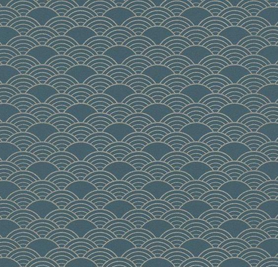
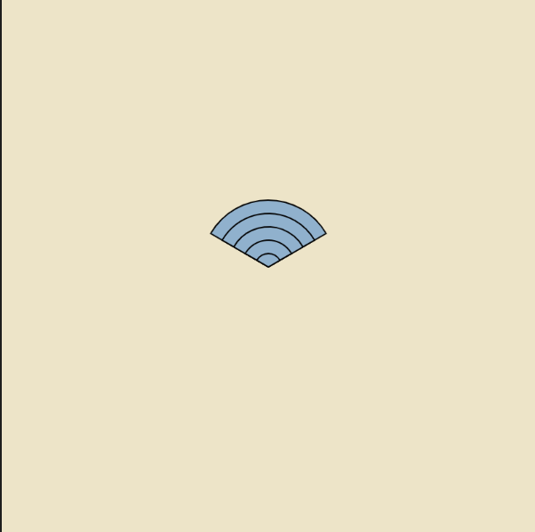
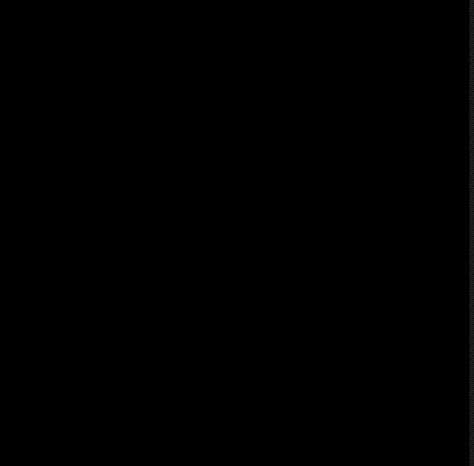
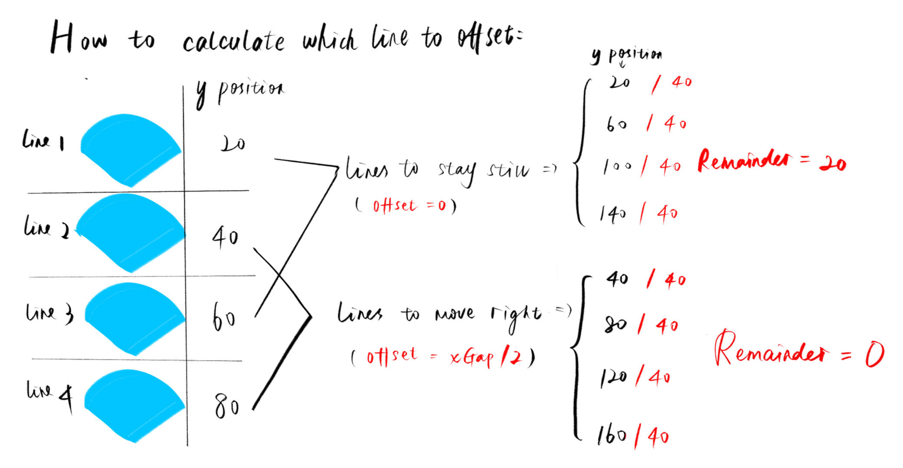
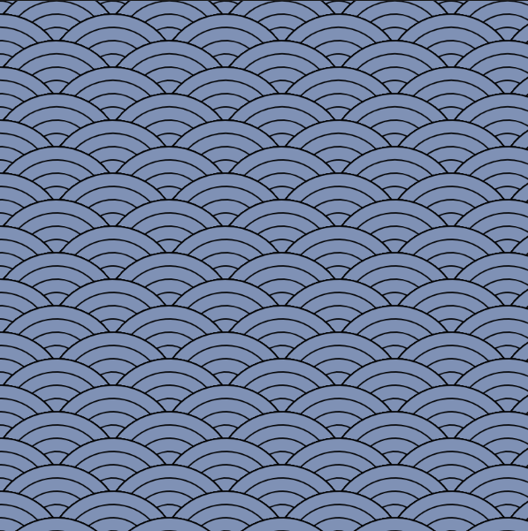
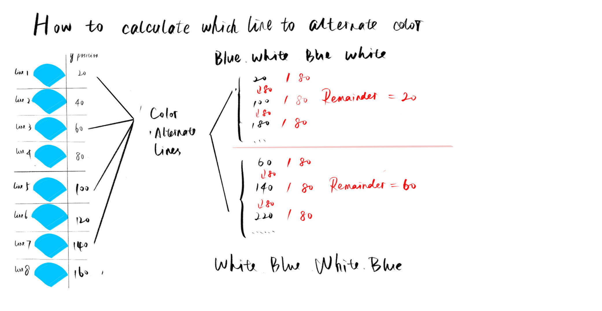
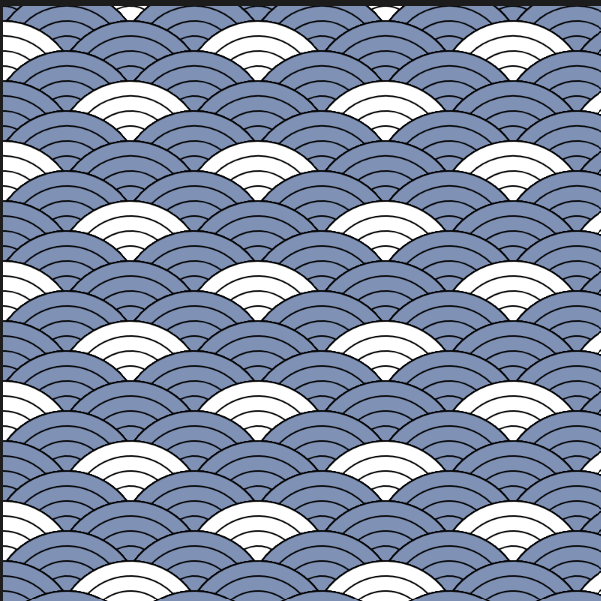
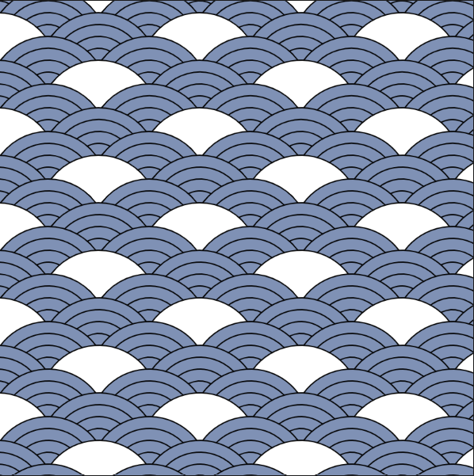
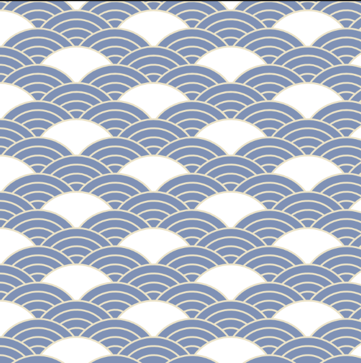

# For Loop

For loop is a very efficient tool for creating repetetive patterns, it makes the code shorter, cleaner and easier to read. This tutorial will introduce forloop/defining new function/modulo by creating a beautiful Japanese style fan pattern:



<br>
<br>

let's first start this whole process by drawing a simple fan pattern using forloop and arc.



```javascript

let fanLayerNum = 5; //how many arcs are within one shape

function setup() {
    createCanvas(400, 400);
    }

    function draw() {
    background(240, 228, 197);

    fill(130, 177, 207);
    for (let i = 0; i < fanLayerNum; i++) {
        arc(
        width / 2,
        height / 2,
        100 - i * 20,
        100 - i * 20,
        (7 / 6) * PI, 
        (-1 / 6) * PI,
        PIE             
        );
    } //draw overlapping arcs to generate a fan pattern
    }
```

<br>
<br>

This whole part of code for drawing the shape mess up the code in draw loop. Thus, we recommend you to define a function especially for drawing this shape. 

<br>

---
### Defining New Function

When you define a new function, it's basically a process of "parameterizing" the feature/aspects/details in the new function.Below is the basic procedure of parameterizing:

1. Identify which value is responsible for the feature.
2. Replace value with a descriptive variable name.
3. List variable name inside the function definition "()".
4. Put actual value into "()" when calling the function.

---
<br>
<br>

In this specific fan example, we want to have different features: x&y positions, different colors of the fan (white & blue), and blue fan with 5 layers, white fan with 1 layer. Then we make these x, y, fanColor, and fanLayerNum as variables. So that we only need to put actual values when calling this function in draw loop.

```javascript

function drawPattern(x, y, fanColor, fanLayerNum){
  // parameterize the features and put them in the function definition
  for (let i = 0; i < fanLayerNum; i++) {
    fill(fanColor);
    arc(x, y, 100 - i * 20, 100 - i * 20, (7 / 6) * PI, (-1 / 6) * PI, PIE);
  }
}


```


<br>
<br>

Then, let's use for loop to call this drawPattern() function, and expand this pattern to whole screen. In the meantime, we assign actual values to the function.


```javascript
// Add these as global variables
let yGap = 20;
let xGap = 85;
let fanColor;
let fanLayerNum;

// add this forloop, you can adjust the gap distance to figure out the best distance between lines and columns
for (let y = 0; y <= height + 100; y += yGap) {
  for (let x = 0; x <= width + 100; x += xGap) {
    fanColor = color(119, 145, 184);
    fanLayerNum = 5;
    drawPattern(x, y, fanColor, fanLayerNum);
  }
}
```


<br>
<br>
But what we want is to make some offset for each line so that the patterns alternate.
In this example, we will need to use %(modulo) to categorize odd and even number lines. Then we need to add an offset variable to move the patterns in every even line a bit.

---

### Modulo and if statement

Module is a good tool for categorizing items into groups based on their remainder after division.

"modulo" refers to the operation of finding the remainder when one number is divided by another. It is denoted by the symbol "%".

For example:

```javascript
let a = 10 % 3; // a == 1
let b = 8 % 6 // b == 2
let c = 15 % 4 // c == 3
```

It is often used as a timer, combining with frameCount() to trigger some certain action in p5js.

For instance:



```javascript
function setup() {
  createCanvas(400, 400);
}

function draw() {
  background(0);
  //The default frame count every second is 60. And frameCount returns a value that plus 1 every frame. 
  if (frameCount % 60 >=0 && frameCount % 60 <=5) { 
    // When the current accumulated frameCount can be divided by 60 and the remainder is between 0 and 5;
    circle(width/2, height/2, 100); // draw a circle for one frame every 1 second;
  }
}

```
In this example, the circle appears every 1 second, and stays for 5/60 seconds.

---

In this fan shape tutorial, let's use modulo to find out which line is the odd and even number lines. And then let's make offset/color/fanLayerNum to the shape.

Here is the process of how we calculate the remainder of the lines.



Thus, we add this if statement inside the for loop.

```javascript
// line2, 4, 6...
if (y % (2 * yGap) == 0) { 
          offset = xGap / 2;
        } else {
          // line 1, 3, 5...
          offset = 0;
        }
```

And change "x" to "x+offset" when calling drawPattern function.

```javascript
  drawPattern(x + offset, y, fanColor, fanLayerNum);
```

So the code now is:

```javascript
 for (let y = 0; y <= height + 100; y += yGap) {
    for (let x = 0; x <= width + 100; x += xGap) {
      for (let x = 0; x <= width + 100; x += xGap) {

        if (y % (2 * yGap) == 0) {
          offset = xGap / 2;
        } else {
          offset = 0;
        }

        fanColor = color(119, 145, 184);
        drawPattern(x + offset, y, fanColor,fanLayerNum);
      }
    }
  }
```



Then let's add white color and different fan layer numbers to the sketch.

We can see the way the patterns are arranged is:
1. One full blue line for every two lines;
2. One line where blue and white alternate for every two lines.
3. The alternating pattern between blue and white differs between the two alternating lines. (One line starts with blue, while the other starts with white.)

Thus, we need to add more modulo if statement to this pattern:



After calculating the y position, we need to start calculating x position to alternate white and blur color within the lines.
We apply a similar calculation method as shown above.


```javascript
// lines with white and blue patterns
if (y % (4 * yGap) == 60) { 
  //white,blue,white,blue...
          if (x % (2 * xGap) == 0) {
            fanColor = color(255);
          } else {
            fanColor = color(119, 145, 184);
          }
        } else { 
          //blue,white,blue,white
          if (x % (2 * xGap) == 85) {
            fanColor = color(255);
          } else {
            fanColor = color(119, 145, 184);
          }
        }
```



We know that all the white fans only has one layer, and all the blue fans have five layers. Thus, we can now also add value to the fanLayerNum variable when we call drawPattern function.

```javascript
for (let y = 0; y <= height + 100; y += yGap) {
    for (let x = 0; x <= width + 100; x += xGap) {
      if (y % (2 * yGap) == 0) {
        offset = xGap / 2;
        fanColor = color(119, 145, 184);
        fanLayerNum = 5; //<--We add this Layer Number variable when calling drawPattern function
      } else {
        if (y % (4 * yGap) == 60) {
          if (x % (2 * xGap) == 0) {
            fanColor = color(255);
            fanLayerNum = 1;
          } else {
            fanColor = color(119, 145, 184);
            fanLayerNum = 5;
          }
        } else {
          if (x % (2 * xGap) == 85) {
            fanColor = color(255);
            fanLayerNum = 1;
          } else {
            fanColor = color(119, 145, 184);
            fanLayerNum = 5;
          }
        }
        offset = 0;
      }
      drawPattern(x + offset, y, fanColor, fanLayerNum);
    }
  }
```

Now the shape looks like:



Congratulations! The shape is almost done. You can add stroke and stroke weight to the pattern so that it looks more like the example pattern.

```javascript
 strokeWeight(2);
 stroke(240, 228, 197);
```




Thank you for reading! Hope you now have a better understanding about forloop, modulo and functions!


